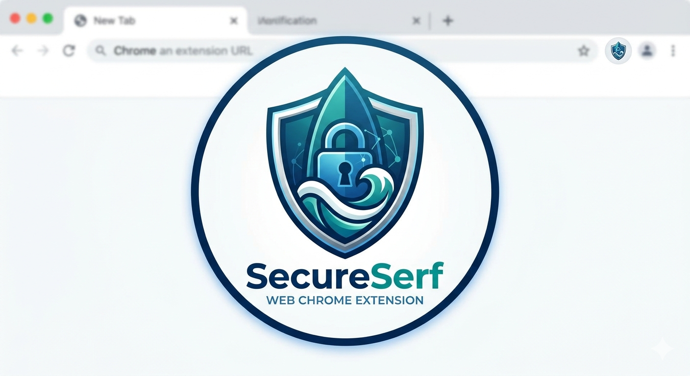

# SecureSurf – Chrome Extension

<div align="center">
  

  <p><strong>Real-time phishing detection for emails and web browsing — right in your browser.</strong></p>

</div>

---

## Problem Statement

Phishing attacks are one of the most common and damaging threats on the web. Most users can't tell a malicious URL from a legitimate one at a glance — and by the time they realize, it's too late. SecureSurf addresses this by analyzing every page you visit in real time, flagging suspicious behavior before you interact with it.

---

## Features

- **Heuristic URL Analysis** — Detects suspicious patterns like raw IPs, dangerous TLDs, brand impersonation in subdomains, URL shorteners, and phishing keywords
- **Google Safe Browsing Integration** — Cross-checks URLs against Google's database of known phishing and malware sites
- **Page Content Scanning** — Reads visible page text for phishing phrases like "verify your identity" or "confirm your account"
- **4-Level Risk Rating** — Instant color-coded risk levels: SAFE, LOW, CAUTION, and DANGER
- **Works Without an API Key** — Heuristics-only mode requires no setup
- **Privacy-First** — No data is sent to external servers unless you opt into Google Safe Browsing

---

## Technology Stack

| Layer | Technology |
|---|---|
| Extension Platform | Chrome Extensions (Manifest V3) |
| Frontend | HTML, CSS, JavaScript |
| Background Logic | Service Worker (`background.js`) |
| Threat Intelligence | Google Safe Browsing API (optional) |
| Detection Engine | Custom heuristic rule system |

---

## Installation

### Load as an Unpacked Extension (Development)

1. Clone or download this repository:
   ```bash
   git clone https://github.com/your-username/SecureSurf.git
   ```
2. Open Chrome and navigate to `chrome://extensions/`
3. Enable **Developer Mode** using the toggle in the top-right corner
4. Click **"Load unpacked"**
5. Select the `SecureSurf/` folder
6. The SecureSurf icon will appear in your Chrome toolbar

---

## Usage

Once installed, SecureSurf runs automatically in the background. No manual action is needed.

- **Visit any website** — SecureSurf analyzes the URL and page content instantly
- **Click the toolbar icon** — View the current page's risk level and a breakdown of detected signals
- **Risk levels explained:**

| Level | Meaning |
|---|---|
| 🟢 Safe | No suspicious signals detected |
| 🔵 Low | Minor signals present, likely fine |
| 🟡 Caution | Multiple suspicious patterns — proceed carefully |
| 🔴 Danger | High-confidence phishing attempt detected |

---

## API Key Setup (Optional)

SecureSurf works out of the box using heuristics only. For enhanced accuracy, connect Google Safe Browsing:

1. Go to [Google Cloud Console](https://console.cloud.google.com/)
2. Enable the **Safe Browsing API**
3. Generate an API key
4. Open `src/background.js` and replace:
   ```js
   const GOOGLE_API_KEY = "YOUR_GOOGLE_SAFE_BROWSING_API_KEY";
   ```
   with your actual key

---

## Project Structure

```
SecureSurf/
├── manifest.json          # Extension configuration (Manifest v3)
├── popup.html             # Extension popup UI (WIP)
├── logo.png               # Extension logo
├── icons/                 # Extension icons
│   ├── icon16.png
│   ├── icon48.png
│   └── icon128.png
└── src/                   # Core extension logic (WIP)
```

---

## Testing Phishing Detection

Use these safe resources to test the extension:

- **[PhishTank](https://phishtank.com)** — Community-verified database of live phishing URLs
- **[Google Safe Browsing Test](https://testsafebrowsing.appspot.com)** — Official test pages for Safe Browsing
- **Synthetic test URL:** `http://paypal-secure-login.tk/verify` — triggers multiple heuristic rules

---

## Roadmap

- [ ] Popup UI with detailed scan results
- [ ] Email scanning support (Gmail integration)
- [ ] Allowlist / blocklist management
- [ ] Dashboard with browsing history and threat log


---

## References

- [Chrome Extensions Documentation](https://developer.chrome.com/docs/extensions/)
- [Google Safe Browsing API](https://developers.google.com/safe-browsing)
- [Manifest V3 Migration Guide](https://developer.chrome.com/docs/extensions/migrating/)

---

## License

This project is licensed under the MIT License. See `LICENSE` for details.

---

> **Beta Notice:** SecureSurf is currently in beta. Detection accuracy is improving. Always exercise caution on unfamiliar websites regardless of the risk rating shown.